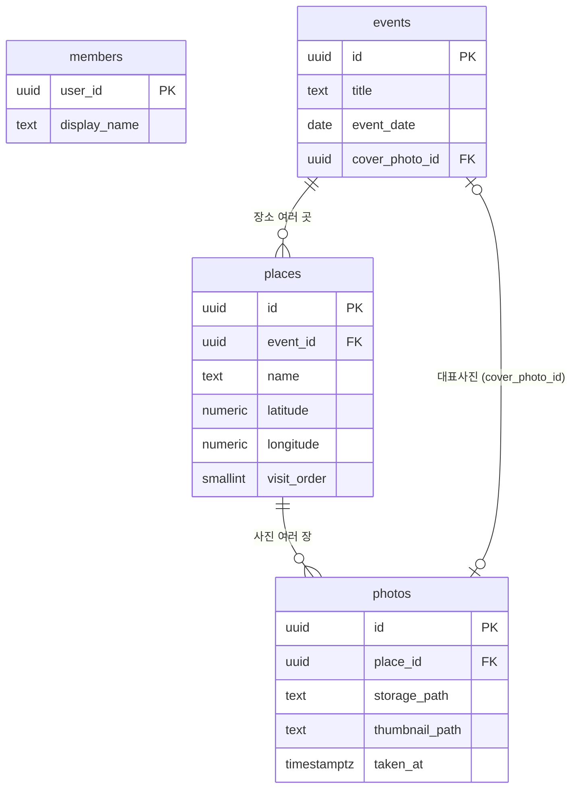
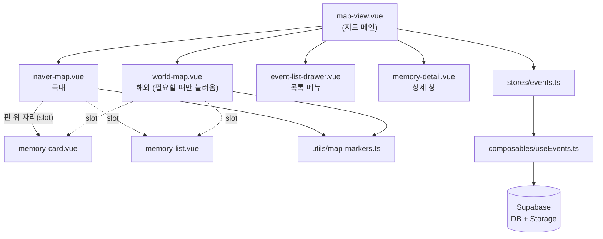

# 보충만의 추억 · 우리 둘만의 지도

두 사람이 함께 간 곳을 **지도 위에 사진으로 남기는** 비공개 추억 지도 웹앱입니다.
사진을 올리면 촬영일과 위치(GPS)를 읽어 지도에 핀으로 꽂고, 하루의 여러 장소를 **방문 순서대로 선으로 이어** 그날의 동선을 보여 줍니다.

- 배포 주소: https://bochung-memory.vercel.app (등록된 두 계정만 로그인 가능)
- 휴대폰 화면을 기준으로 만들었고 PC에서도 동작합니다. 라이트·다크 모드는 휴대폰 설정을 따릅니다.

---

## 목차

1. [기술 스택](#1-기술-스택)
2. [화면 구성](#2-화면-구성)
3. [기능이 동작하는 방식](#3-기능이-동작하는-방식)
4. [DB 구조](#4-db-구조)
5. [프론트엔드 구조](#5-프론트엔드-구조)
6. [디자인 규칙](#6-디자인-규칙)
7. [실행·테스트·배포](#7-실행테스트배포)
8. [작업 기록](#8-작업-기록)
9. [남은 일과 앞으로의 선택지](#9-남은-일과-앞으로의-선택지)

---

## 1. 기술 스택

| 구분 | 사용 기술 | 하는 일 |
|---|---|---|
| 화면 | Vue 3 + TypeScript + Vite | 앱 화면 전체 |
| 상태 관리 | Pinia | 로그인 상태, 추억 목록 |
| 화면 이동 | Vue Router | 주소별 화면, 로그인 안 하면 로그인 화면으로 |
| 스타일 | Tailwind CSS v4 + CSS 변수(디자인 토큰) | 색·글꼴·모서리 규칙 |
| DB·로그인·사진 저장 | Supabase (Postgres, Auth, Storage) | 데이터 저장, 두 사람만 접근하도록 보안 |
| 국내 지도 | 네이버 지도 v3 | 한국 안의 장소 |
| 해외 지도 | Leaflet + OpenStreetMap | 한국 밖의 장소 (무료) |
| 사진 정보 읽기 | ExifReader | 촬영일·GPS 읽기 (JPEG·HEIC 모두) |
| 아이폰 사진 | heic-to | HEIC를 JPEG로 변환 (HEIC를 고를 때만 불러옴) |
| 아이콘·글꼴 | Phosphor Icons, Pretendard(본문), Jua(제목), Gaegu(로고) | 모두 앱에 포함 (외부 링크 없음) |
| 테스트 | Playwright | 휴대폰·PC 화면 E2E 테스트 |
| 배포 | Vercel | GitHub `main`에 push하면 자동 배포 |
| 홈 화면 설치 | vite-plugin-pwa (PWA) | 휴대폰 홈 화면에 앱처럼 설치, 새 버전 자동 반영 |

---

## 2. 화면 구성

| 주소 | 화면 | 파일 | 하는 일 |
|---|---|---|---|
| `/login` | 로그인 | `views/login-view.vue` | 이메일·비밀번호 로그인 (회원가입 없음) |
| `/` | 지도 (메인) | `views/map-view.vue` | 핀, 추억 카드, 이전·다음 추억, 목록 메뉴, 국내↔해외 지도 |
| `/upload` | 사진 올리기 | `views/upload-view.vue` | 사진 선택 → 날짜·위치 확인 → 추억 만들기/추가 → 업로드 |
| `/events/:id/photos` | 사진 모아 보기 | `views/event-photos-view.vue` | 장소별 사진, 크게 보기, 수정·삭제, 대표사진 지정 |

로그인하지 않으면 어느 주소로 들어가도 로그인 화면으로 가고, 로그인하면 원래 가려던 화면으로 돌아옵니다 (`router/index.ts`).

---

## 3. 기능이 동작하는 방식

### 3-1. 로그인

```
이메일·비밀번호 입력
  → login_locked_until() 로 잠겨 있는지 확인 (잠겨 있으면 "N분 뒤에 다시 시도해 주세요")
  → Supabase Auth 로그인
      └ 비밀번호가 틀리면 login_failed() 로 기록 → "남은 기회 N번" / 5번째면 10분 잠금
  → is_member() 로 "등록된 두 사람 중 하나인지" 확인
      ├ 맞음  → login_succeeded() 로 실패 기록 지우고, 원래 가려던 화면으로
      └ 아님  → 바로 로그아웃 + "아직 등록되지 않은 계정이에요. 상대에게 등록을 부탁해 주세요."
```

- **10분 안에 비밀번호를 5번 틀리면 그 이메일은 10분 동안 로그인할 수 없습니다.** 횟수와 잠금 시각은 DB 함수만 바꿀 수 있어 브라우저에서 고치거나 지울 수 없습니다.
  - Supabase의 서버쪽 로그인 훅은 Teams 요금제 이상 전용이라 무료 요금제에 맞춰 만든 방식입니다. 앱을 거치지 않고 Auth API를 직접 부르는 시도는 Supabase 기본 IP 요청 제한이 막습니다.
- 회원가입 화면은 없습니다. 계정은 Supabase 대시보드에서 만들고 `members` 표에 등록합니다.
- 비밀번호가 틀리면 칸이 빨갛게 표시되고, 다시 입력하면 오류가 사라집니다.
- 연결 오류 등 다른 문제는 "연결이 불안정해요. 잠시 후 다시 시도해 주세요."로 보여 주고, 원인은 콘솔에만 남깁니다.
- 로그아웃은 **이 기기만** 로그아웃됩니다 (같은 계정의 다른 기기는 그대로).

### 3-2. 사진 올리기

```
① 사진 여러 장 선택 (jpg · png · webp · heic, 한 장 20MB까지)
② 원본에서 촬영일·GPS 읽기 (ExifReader)
     └ 위치가 없으면 지도에서 직접 고르기, 날짜가 없으면 직접 입력
③ 150m 안에서 찍은 사진끼리 "한 장소"로 묶고, 촬영 시각 순서로 방문 순서를 정함
④ 새 추억(제목·날짜)을 만들거나 기존 추억에 추가
     └ 같은 제목의 추억이 있으면 "여기에 추가할까요?" 제안
⑤ 브라우저에서 줄이기: 긴 변 2048px JPEG + 400px 썸네일
     └ 아이폰 HEIC는 여기서 JPEG로 변환 (저장은 항상 .jpg)
⑥ Storage에 업로드 (진행률 표시) → places · photos · events 기록 저장
⑦ reorder_places() 로 추억 안의 장소 순서를 촬영 시각 순서로 다시 매김
     └ 기존 추억에 나중에 추가해도 시간 순서대로 끼워 넣어짐
⑧ "지도에서 보기" → 방금 올린 추억이 지도에서 바로 열림
```

- **장소 순서 규칙:** 장소마다 가장 이른 촬영 시각으로 정렬합니다. 촬영 시각이 없는 장소는 올린 순서대로 뒤에 놓입니다.
- 장소 이름은 입력하지 않아도 됩니다. 이름이 없으면 화면에 "1번째 장소", "3곳 중 2번째 장소"처럼 보이고, 나중에 사진 모아 보기에서 붙일 수 있습니다.
- 사진은 올리기 전에 줄이기 때문에 **한 장 약 0.52MB**(본 사진 약 500KB + 썸네일 약 35KB)만 저장됩니다.
- DB 저장에 실패하면 올린 파일을 지우고, 다시 시도할 때 추억이 두 번 만들어지지 않게 합니다.

### 3-3. 지도에서 보기

```
추억 목록 불러오기 (추억 → 장소 → 사진, 썸네일은 1시간짜리 서명 URL)
  → 좌표가 거의 같은 장소(소수 4자리, 약 10m)를 핀 하나로 묶기
  → 화면에서 48px 안에 모인 핀은 "클러스터"(숫자 원)로 묶기
  → 핀을 누르면
      ├ 추억 1개  → 핀 위에 사진 카드 (말풍선)
      └ 추억 여러 개 → 반투명 목록 → 고르면 카드
```

| 조작 | 동작 |
|---|---|
| 카드 양옆 분홍 띠 ‹ › (또는 카드 좌우 스와이프) | 같은 추억 안의 **이전·다음 장소** |
| 화면 아래 "← 이전 추억 / 다음 추억 →" | 시간순으로 **다른 추억**으로 이동 |
| 카드 누르기 | 상세 창 (사진 넘겨 보기, 제목·날짜·장소·설명) |
| 지도 빈 곳 누르기 | 카드 닫기 |
| 왼쪽 위 ☰ | 추억 목록 (최신순, 장소가 여러 곳이면 펼쳐서 장소 고르기) |

- 선택한 추억의 장소들은 방문 순서대로 **포인트 색 선**으로 이어집니다.
- 카드는 지도 밖 레이어에 두고 위치만 계산해 핀을 따라가게 했습니다. (지도 안에 넣으면 휴대폰에서 카드를 누른 뒤 지도가 끌려가는 문제가 있었습니다.)
- "N번째 우리들의 추억" 번호는 날짜 순서로 매깁니다.

### 3-4. 국내 지도 ↔ 해외 지도

네이버 지도는 한국 범위(위도 32.1~38.6, 경도 124.3~132.0) 밖으로 움직이지 못합니다. 그래서 해외 장소는 세계 지도로 보여 줍니다.

```
보고 있는 장소가 한국 안  → 네이버 지도
보고 있는 장소가 한국 밖  → 세계 지도 (Leaflet + OpenStreetMap)
```

- 목록에서 해외 추억을 고르거나 이전·다음으로 넘기면 지도가 **자동으로 바뀝니다**.
- 국내 지도 오른쪽 위 **"해외 추억 N"**, 세계 지도 오른쪽 위 **"국내 지도"** 버튼으로도 오갈 수 있습니다.
- 세계 지도 코드(약 45KB)는 해외 추억을 열 때만 불러옵니다. 불러오는 중에는 "세계 지도를 여는 중…", 실패하면 자동으로 2번 다시 받고 그래도 안 되면 "다시 시도" 버튼을 보여 줍니다.
- 핀 모양·묶기 규칙은 두 지도가 같은 코드(`utils/map-markers.ts`)를 씁니다.

### 3-5. 수정·삭제

| 대상 | 할 수 있는 것 | 위치 |
|---|---|---|
| 추억 | 제목·날짜·설명 수정, 추억 전체 삭제 (사진 수 안내 후 확인) | 사진 모아 보기 |
| 장소 | 이름 붙이기·지우기 (비우면 "N번째 장소"로 돌아감) | 사진 모아 보기 |
| 사진 | 삭제, 대표사진 지정 | 사진 크게 보기 |

- **DB 기록을 먼저 지우고 파일은 나중에** 지웁니다. 파일 삭제가 실패해도 깨진 사진은 생기지 않습니다.
- 장소의 마지막 사진을 지우면 장소도 지워지고, 대표사진을 지우면 남은 사진 중 가장 먼저 찍은 사진이 대표가 됩니다.

---

## 4. DB 구조

추억 하나(하루의 데이트·여행) 안에 여러 장소가 있고, 장소마다 여러 사진이 있습니다.



### members · 앱을 쓸 수 있는 사람

| 컬럼 | 타입 | 설명 |
|---|---|---|
| `user_id` | uuid, PK | Supabase Auth 계정 id (계정이 지워지면 함께 지워짐) |
| `display_name` | text | 표시 이름 |
| `created_at` / `updated_at` | timestamptz | 만든·고친 시각 (자동) |

### events · 추억 (하루의 데이트·여행)

| 컬럼 | 타입 | 설명 |
|---|---|---|
| `id` | uuid, PK | |
| `title` | text (1~100자) | 추억 제목 |
| `description` | text, 비워도 됨 | 설명 |
| `event_date` | date | 추억 날짜 (새로 만들면 가장 이른 촬영일로 자동 입력) |
| `cover_photo_id` | uuid → photos, 비워도 됨 | 대표사진 (사진이 지워지면 비워짐) |
| `created_by` | uuid → auth.users | 만든 사람 (자동) |
| `created_at` / `updated_at` | timestamptz | 자동 |

### places · 추억 안의 장소

| 컬럼 | 타입 | 설명 |
|---|---|---|
| `id` | uuid, PK | |
| `event_id` | uuid → events | 어느 추억의 장소인지 (추억을 지우면 함께 지워짐) |
| `name` | text (1~100자) | 직접 붙인 이름만 저장. 이름이 없으면 `'장소'`로 저장하고 화면에서 "N번째 장소"로 표시 |
| `latitude` / `longitude` | numeric(9,6) | 좌표 |
| `visit_order` | smallint | 방문 순서 (선을 잇는 순서). 촬영 시각 순서로 매김, 추억 안에서 겹치지 않음 |
| `created_at` / `updated_at` | timestamptz | 자동 |

> 같은 곳을 다른 날 또 가면 추억마다 장소 기록이 따로 생기고, 지도에서 좌표로 묶어 핀 하나에 "추억 N개"로 보여 줍니다.
> 네이버 약관 때문에 장소 이름은 네이버에서 받아 온 주소가 아니라 사용자가 입력한 값만 저장합니다.

### photos · 사진

| 컬럼 | 타입 | 설명 |
|---|---|---|
| `id` | uuid, PK | |
| `place_id` | uuid → places | 어느 장소의 사진인지 (장소를 지우면 함께 지워짐) |
| `storage_path` | text, 중복 불가 | Storage 경로 `{추억 id}/{사진 id}.jpg` |
| `thumbnail_path` | text | 썸네일 경로 `{추억 id}/thumb/{사진 id}.jpg` |
| `taken_at` | timestamptz | 촬영 시각 (EXIF 또는 직접 입력) |
| `latitude` / `longitude` | numeric(9,6) | 사진 자체의 좌표 (원본 보존용) |
| `width` / `height` | integer | 줄인 뒤의 크기 |
| `created_by` | uuid → auth.users | 올린 사람 (자동) |
| `created_at` / `updated_at` | timestamptz | 자동 |

### login_failures · 로그인 실패 기록

| 컬럼 | 타입 | 설명 |
|---|---|---|
| `email` | text, PK | 로그인을 시도한 이메일 (소문자) |
| `fail_count` | smallint | 연속 실패 횟수 (마지막 실패에서 10분 지나면 다시 1부터) |
| `last_failed_at` | timestamptz | 마지막 실패 시각 (하루 지난 기록은 자동 삭제) |
| `locked_until` | timestamptz | 잠금이 풀리는 시각 (잠기지 않았으면 비어 있음) |

> 브라우저는 이 표를 직접 읽거나 고칠 수 없고, 아래 `login_*` 함수로만 다룹니다.

### Storage · 사진 파일

| 항목 | 값 |
|---|---|
| 버킷 | `photos` (**비공개**) |
| 파일 크기 제한 | 10MB (실제로는 줄여서 약 0.5MB) |
| 허용 형식 | jpeg, png, webp, heic, heif |
| 보여 주는 방법 | 1시간짜리 **서명 URL** (주소를 알아도 1시간 뒤에는 못 봄) |

### 함수

| 함수 | 하는 일 |
|---|---|
| `is_member()` | 지금 로그인한 사람이 `members`에 있는지. 모든 보안 규칙이 이 함수를 씀 |
| `places_in_bounds(...)` | 지도 화면 범위 안의 장소 (준비만 해 둠, 현재 미사용) |
| `events_within_radius(...)` | 기준 좌표 반경 안의 추억, 가까운 순 (준비만 해 둠, 현재 미사용) |
| `set_updated_at()` | 고칠 때 `updated_at` 자동 갱신 (트리거) |
| `reorder_places(event_id)` | 추억 안의 장소 순서를 촬영 시각 순서로 다시 매김 (시간 없는 장소는 올린 순서대로 뒤에) |
| `login_locked_until(email)` | 그 이메일이 잠겨 있으면 풀리는 시각 (로그인 전에 호출) |
| `login_failed(email)` | 비밀번호 실패 기록, 5번째면 10분 잠금. 남은 기회를 돌려줌 |
| `login_succeeded()` | 로그인한 본인의 실패 기록 삭제 |

### 보안 (두 사람만 볼 수 있게)

- 모든 표에 **RLS(행 단위 보안)**를 켜고, `is_member()`가 참인 사람만 읽기·쓰기·삭제할 수 있습니다. 사진 파일(Storage)도 같은 규칙입니다.
- 로그인하지 않은 사용자(anon)는 표와 함수에 아예 접근할 수 없습니다 (`002_harden_grants.sql`).
- `members`는 앱에서 읽기만 됩니다. 사람 추가·삭제는 Supabase 대시보드에서만 합니다.
- 브라우저에는 공개용 키(publishable key)만 들어갑니다. 비밀 키는 앱에서 쓰지 않습니다.

| 마이그레이션 | 내용 |
|---|---|
| `supabase/migrations/001_init.sql` | 표 4개, RLS 정책, Storage 버킷과 정책, 조회 함수 |
| `supabase/migrations/002_harden_grants.sql` | 로그인하지 않은 접근 차단, 권한 명시 |
| `supabase/migrations/003_login_lockout.sql` | 비밀번호 5번 실패 시 10분 잠금 |
| `supabase/migrations/004_reorder_places.sql` | 장소 순서를 촬영 시각 순서로 다시 매기는 함수 |

---

## 5. 프론트엔드 구조

### 폴더와 파일

```
src/
├─ main.ts                    앱 시작 (Pinia, Router 연결)
├─ App.vue                    화면 틀 (RouterView)
├─ style.css                  디자인 토큰(색·그림자·글꼴), 공통 입력칸·버튼, 등장 애니메이션
├─ router/
│  └─ index.ts                주소 4개 + 로그인 가드
├─ views/                     ── 화면(주소 하나에 하나)
│  ├─ login-view.vue          로그인
│  ├─ map-view.vue            지도 메인: 국내/해외 지도 전환, 카드·목록, 이전·다음 추억
│  ├─ upload-view.vue         사진 올리기 전체 흐름
│  └─ event-photos-view.vue   사진 모아 보기, 추억·장소 수정, 삭제
├─ components/                ── 화면을 이루는 조각
│  ├─ naver-map.vue           국내 지도: 핀·클러스터·경로 선·카드 위치 계산
│  ├─ world-map.vue           해외 지도(Leaflet): naver-map 과 같은 입력·동작
│  ├─ world-map-state.vue     세계 지도 불러오는 중 / 실패 안내
│  ├─ memory-card.vue         핀 위 사진 카드 (양옆 장소 이동 띠)
│  ├─ memory-list.vue         추억 여러 개인 핀의 목록
│  ├─ memory-detail.vue       카드를 누르면 뜨는 상세 창
│  ├─ event-list-drawer.vue   왼쪽 추억 목록 메뉴 (펼쳐서 장소 고르기, 로그아웃)
│  ├─ photo-viewer.vue        사진 크게 보기 (넘기기·삭제·대표 지정)
│  ├─ location-picker.vue     올리기에서 위치 없는 사진의 위치 고르기
│  └─ page-header.vue         상단바 (뒤로 가기 + 제목)
├─ stores/                    ── 여러 화면이 함께 쓰는 상태 (Pinia)
│  ├─ auth.ts                 로그인 세션, 로그인·로그아웃, 멤버 확인
│  └─ events.ts               추억 목록, 시간순 번호, 지도 핀 만들기
├─ composables/               ── Supabase·지도·사진 처리 함수
│  ├─ useSupabase.ts          Supabase 클라이언트 (처음 쓸 때 만듦)
│  ├─ useEvents.ts            추억·장소·사진 읽기/만들기/고치기/지우기, 서명 URL
│  ├─ usePhotos.ts            파일 검사, EXIF 읽기, HEIC 변환, 줄이기, 진행률 업로드
│  └─ useNaverMaps.ts         네이버 지도 스크립트 불러오기
├─ utils/
│  ├─ map-markers.ts          핀·클러스터 모양, 묶기 규칙, 한국 범위 판별 (두 지도 공용)
│  ├─ place-name.ts           "N번째 장소" 이름 규칙
│  └─ format-date.ts          날짜 표시 형식
└─ types/
   └─ models.ts               앱에서 쓰는 자료형 (Place, EventItem, MapMarker)
```

### 화면 조립 (지도 화면 기준)



### 데이터가 흐르는 길

```
Supabase ──(useEvents.fetchEvents)──▶ stores/events.ts ──▶ map-view.vue ──▶ 지도·카드·목록
   ▲                                    (시간순 정렬, 번호,
   │                                     좌표로 핀 묶기)
   └──(usePhotos 줄이기·업로드, useEvents 기록 저장)── upload-view.vue
```

- 지도 두 개(`naver-map`, `world-map`)는 **같은 입력**(핀 목록, 강조할 핀, 경로 추억, 초점 좌표)을 받고, 같은 방식으로 카드를 핀 위에 붙입니다. 그래서 `map-view`는 어느 지도인지 신경 쓰지 않고 한 줄(`<component :is>`)로 바꿔 끼웁니다.

---

## 6. 디자인 규칙

| 항목 | 규칙 |
|---|---|
| 메인 색 | 차분한 보라 `#6B5B95` (다크 `#9A8AC7`) |
| 포인트 색 | 로즈 코랄 `#C7404F`: "지금 보고 있는 것"에만 (선택한 핀, 경로 선, 숫자 배지) |
| 오류 글자 | 라이트 `#A8303E` / 다크 `#FF9AA4` (배경 대비 4.5:1 이상) |
| 글꼴 | 본문 Pretendard, 제목 Jua, 로고 Gaegu |
| 모서리 | 카드·시트 16px, 버튼 알약형, 입력칸 10px |
| 그림자 | 검정 대신 보랏빛 그림자 |
| 아이콘 | Phosphor 한 가지. 누르는 버튼은 bold, 내용 아이콘은 regular |
| 움직임 | 휴대폰의 "동작 줄이기" 설정이면 모두 끔 |
| 접근성 | 글자 대비 WCAG AA, 오류는 화면 읽기 프로그램에도 전달 (role="alert", aria-invalid) |

- 색은 `src/style.css`의 CSS 변수 하나로 관리하고, 지도 핀도 같은 변수를 씁니다.
- 제품 설명과 디자인 원칙은 [`PRODUCT.md`](PRODUCT.md)에 있습니다.

---

## 7. 실행·테스트·배포

### 처음 실행

```bash
npm install
cp .env.example .env   # 값 채우기 (아래 표)
npm run dev            # http://localhost:5173
```

| 환경변수 | 어디서 | 브라우저에 들어가도 되나 |
|---|---|---|
| `VITE_SUPABASE_URL` | Supabase > Project Settings > API | 됨 |
| `VITE_SUPABASE_PUBLISHABLE_KEY` | Supabase > API Keys (publishable) | 됨 |
| `VITE_NAVER_MAP_CLIENT_ID` | 네이버 클라우드 > Maps > Application | 됨 |
| `NAVER_MAP_CLIENT_SECRET` | 네이버 클라우드 | **안 됨** (`VITE_` 붙이지 말 것, 앱에서 안 씀) |
| `SUPABASE_SECRET_KEY` | Supabase | **안 됨** (`VITE_` 붙이지 말 것, 앱에서 안 씀) |

`.env`, `.env.test`는 git에 올라가지 않습니다.

### 명령어

| 명령 | 하는 일 |
|---|---|
| `npm run dev` | 개발 서버 |
| `npm run build` | 타입 검사 + 배포용 빌드 (`dist/`) |
| `npm run test:e2e` | E2E 테스트 전체 (휴대폰 390×844 + PC 1280×800) |
| `npm run test:e2e:ui` | 테스트를 화면으로 보며 실행 |
| `npm run test:e2e:report` | 마지막 테스트 결과 보기 |
| `npm run test:e2e:failed` | 실패한 테스트만 다시 |

### E2E 테스트

- `e2e/` 폴더: 로그인(`auth`), 올리기(`upload`, HEIC 포함), 지도(`map`), 수정·삭제(`manage`).
- 테스트용 멤버 계정으로 실제 Supabase를 쓰며, 제목에 `[E2E]`가 붙은 테스트 데이터만 만들고 끝나면 지웁니다.
- 계정 정보는 `.env.test`에 넣습니다 (git 제외). 배포 사이트를 테스트하려면 `E2E_BASE_URL`을 지정합니다.

### 배포

- GitHub `main`에 push하면 Vercel이 자동으로 빌드·배포합니다.
- `vercel.json`: 새로고침해도 404가 나지 않도록 모든 주소를 `index.html`로 보냄. Node 22 고정.
- Vercel 환경변수에는 `VITE_`로 시작하는 3개만 넣습니다.
- 네이버 클라우드 콘솔의 서비스 URL에 배포 주소를 등록해야 지도가 뜹니다.

### 휴대폰 홈 화면 설치 (PWA)

Play 스토어 대신 PWA로 설치합니다. 배포하면 설치된 앱에도 바로 반영됩니다.

| 기기 | 설치 방법 |
|---|---|
| 안드로이드 | 크롬에서 사이트 열기 → 메뉴(⋮) → "앱 설치" 또는 "홈 화면에 추가" |
| 아이폰 | **사파리**로 열기 → 공유 버튼 → "홈 화면에 추가" (다른 브라우저는 안 됨) |

- 설정: `vite.config.ts`의 `VitePWA` (앱 이름 "보충만의 추억", 주소창 없이 열기, 보라 테마색, 아이콘 `public/pwa-*.png`)
- 서비스 워커는 **앱 파일(HTML·JS·CSS·아이콘)만** 저장합니다. Supabase(데이터·사진), 네이버 지도, OpenStreetMap 요청은 저장하지 않고 항상 네트워크로 받습니다(네이버 약관의 저장·캐싱 금지, 사진은 비공개).
- 글꼴 조각과 HEIC 변환기(약 3MB)는 설치 때 받지 않고 필요할 때 받습니다.
- 새 버전은 자동으로 적용되고(`autoUpdate`), `vercel.json`이 `sw.js`·`manifest.webmanifest`·`index.html`에 캐시가 걸리지 않게 합니다.
- 한계: 아이폰은 오래 안 쓰면 저장 공간을 비워 로그인이 풀릴 수 있습니다(추억 데이터는 Supabase에 그대로 있음).

---

## 8. 작업 기록

| 단계 | 한 일 |
|---|---|
| 준비 | Node 22 설치, Vue 3 + Vite 프로젝트, Supabase·네이버 지도 키 연결 |
| DB | 표 4개 + RLS + 비공개 Storage 설계, 권한 강화(002) |
| 디자인 1단계 | 흑백 스케치(와이어프레임)로 화면 구성 확인 |
| 지도 | 네이버 지도, 핀 묶기(클러스터), 방문 순서 경로 선 |
| 로그인 | 두 사람만 로그인, 로그인 가드, 이 기기만 로그아웃 |
| 올리기 | EXIF 읽기, 150m 장소 묶기, 줄이기·썸네일, 진행률 업로드 |
| 모아 보기 | 장소별 사진, 크게 보기(스와이프·키보드) |
| 수정·삭제 | 추억·장소·사진 수정·삭제, 대표사진 |
| 디자인 2단계 | 보라 테마·다크 모드, "보충만의 추억" 로고, 핀 위 카드와 이전·다음 추억 |
| 레퍼런스 맞추기 | 카드가 핀을 따라다니기, 부드러운 확대·이동, 상세 창, 올린 뒤 바로 보기 |
| 장소 이름 없애기 | 이름 입력 없이 "N번째 장소", 같은 제목 추억에 추가 제안 |
| E2E 테스트 | Playwright 테스트 구축, 테스트 중 찾은 버그 2개 수정 |
| 파비콘 | 보라 바탕 + 지도 핀 + 하트 |
| 배포 | GitHub + Vercel 자동 배포, push 전 민감 정보 점검 |
| PWA | 휴대폰 홈 화면 설치 (manifest, 아이콘, 서비스 워커) |
| HEIC | 아이폰 사진 변환 업로드, EXIF 라이브러리 교체 |
| 디자인 3단계 | impeccable로 로그인 화면 마감 (대비, 비밀번호 보기, 오류 안내, 핀 경로 그림) |
| 해외 추억 | 국내 네이버 + 해외 세계 지도 자동 전환 |
| 모바일 수정 | 이전·다음 추억 버튼을 화면 아래로 옮겨 카드와 겹침 해결 |

자세한 작업 기록은 노션 "PhotoShare Web App" 아래 피드백·테스트·회고 페이지에 있습니다.

---

## 9. 남은 일과 앞으로의 선택지

### 남은 일

- 업로드할 때 GPS가 없는 **해외 사진의 위치 고르기** (위치 고르기가 네이버 지도라 지금은 국내만)
- 이미 올린 사진의 **위치 수정**
- **비밀번호 재설정** 화면
- 사진을 다른 장소·추억으로 옮기기, 여러 장 한꺼번에 삭제
- 사진 **일괄 업로드** (PC에서 폴더째, 날짜별로 추억 자동 나누기)

### 저장 용량

| | Supabase 무료 (지금) | Cloudflare R2 무료 (검토만) |
|---|---|---|
| 저장 | 1GB, 사진 약 1,900장 | 10GB, 사진 약 19,000장 |
| 전송량 | 월 5GB | 무제한 무료 |
| 바꿀 것 | 없음 | 사진 파일만 R2로. 비공개로 보여 주려면 서명 URL을 만드는 작은 서버 코드(Vercel 함수 또는 Worker) 필요 |

지금(사진 16장, 약 8MB) 기준으로 1,000장까지는 Supabase 무료로 충분합니다. 약 1,900장을 넘길 때 R2 이전을 검토합니다.
